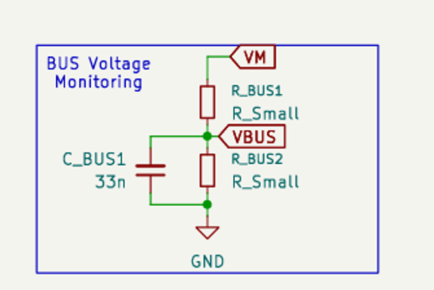
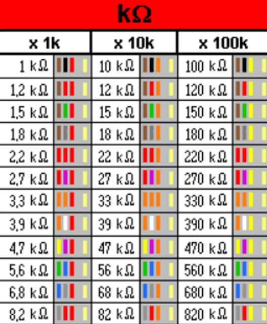
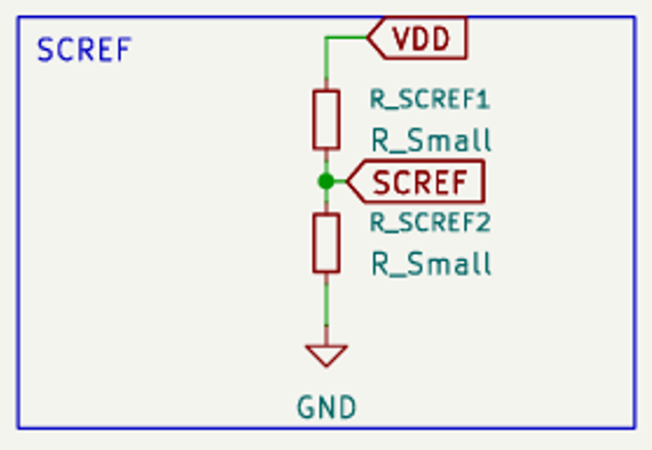
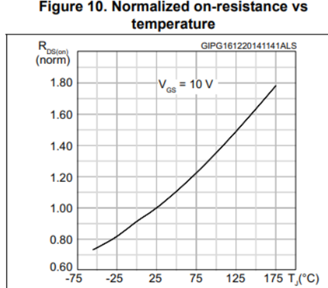

# Dimensionnement des composants

1. **Dimensionnement du pont diviseur pour la mesure de la tension Bus**

On a :

* Tension d'entrée (VM) : Maximum 48V nominal. Une batterie de 48V chargée à bloc peut monter à environ 54V. Par mesure de sécurité, on va dimensionner pour une tension maximale de VM_max = 60V (marge dynamique)

* Tension de sortie (VBUS) : Elle doit entrer dans la broche PA0 du STM32G4. La limite est de 3,3V. Encore une fois, on prend par mesure de sécurité VBUS = 3V (marge statique)

Formule du pont diviseur de tension :

$$VBUS=VM*\frac{Rbus2}{Rbus1+Rbus2}$$

Donc :

$$\frac{Rbus2}{Rbus1+Rbus2}=\frac{VBUS}{VM}=\frac{3}{60}=0,05$$

On cherche alors la meilleure combinaison de résistances de la norme E12 pour s’approcher au maximum de ce ratio de 0,05.

<figure style="float: left; width: 250px; margin: 0 20px 15px 0; text-align: center;">
  
  <figcaption style="font-size: 0.9em; font-style: italic; color: gray;">Norme E12</figcaption>
</figure>
    
On trouve alors que la meilleure combinaison est :
  
* Rbus1 = 68 kΩ
  
* Rbus2 = 3,3 kΩ

 
 
2. **Dimensionnement du pont diviseur pour la protection matérielle surintensité**

On a :

* Tension d'entrée (VDD) : 3,3V

* Courant de coupure cible (Imax) : 100 A. C'est la limite maximale autorisée dans le moteur pour protéger l'onduleur

* Résistance du MOSFET (RDS(on)) : La fiche technique du STB100N6F7 indique 5,6mΩ à froid (25°C). Par mesure de sécurité (marge thermique), on se base sur la résistance à 125°C qui a pour valeur le résistance à froid multipliée par un facteur de 1,5  

 
On dimensionne donc pour un RDS(on)_chaud = 8,4mΩ.

* Tension de sortie cible (VSCREF) : C'est la tension qui sera lue aux bornes du MOSFET à 100A. D'après la loi d'Ohm, on veut VSCREF = 100A * 0,0084Ω = 0,84V.

Formule du pont diviseur de tension :

$$VSCREF=VDD*\frac{RSCREF2}{RSCREF1+RSCREF2}$$

Donc :

$$\frac{RSCREF2}{RSCREF1+RSCREF2}=\frac{VSCREF}{VDD}=\frac{0,84}{3,3}=0,2545$$

Comme avant, on cherche alors la meilleure combinaison de résistances de la norme E12 pour s’approcher au maximum de ce ratio de 0,2545.

<figure style="float: left; width: 250px; margin: 0 20px 15px 0; text-align: center;">
  
  <figcaption style="font-size: 0.9em; font-style: italic; color: gray;">Norme E12</figcaption>
</figure>
    
On trouve alors que la meilleure combinaison est :
  
* RSCREF1 = 10 kΩ
  
* RSCREF2 = 3,3 kΩ

