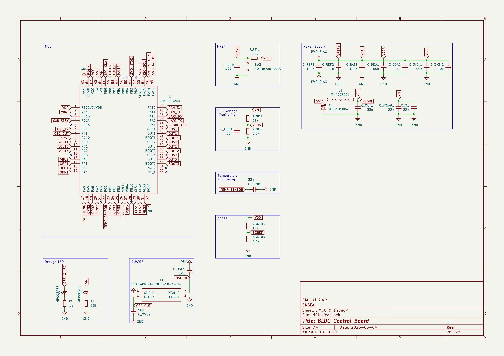
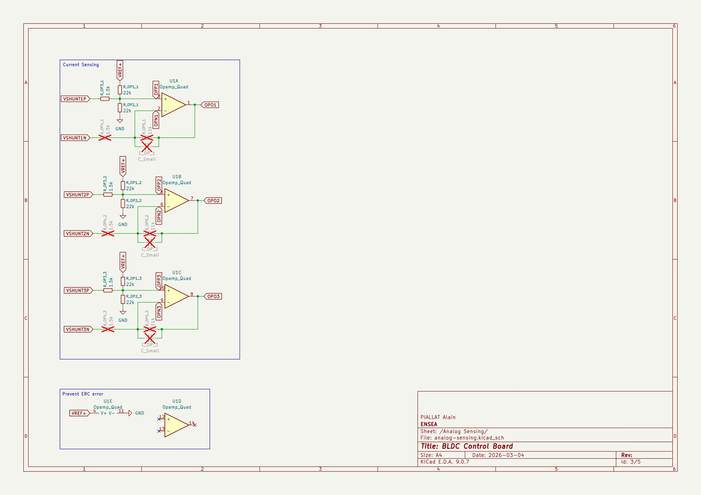
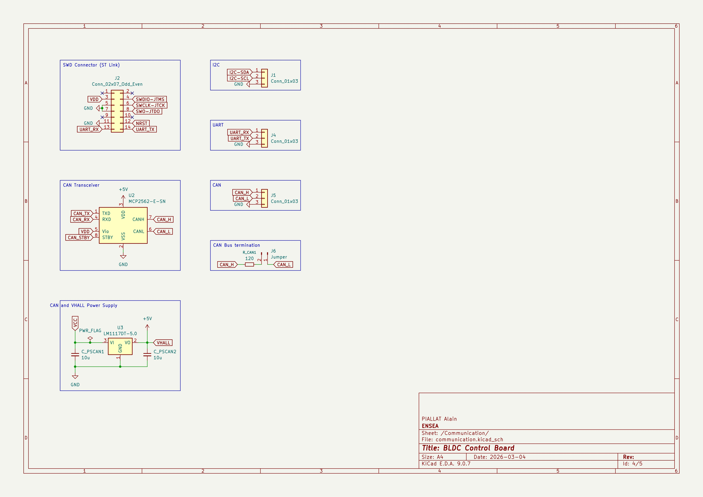
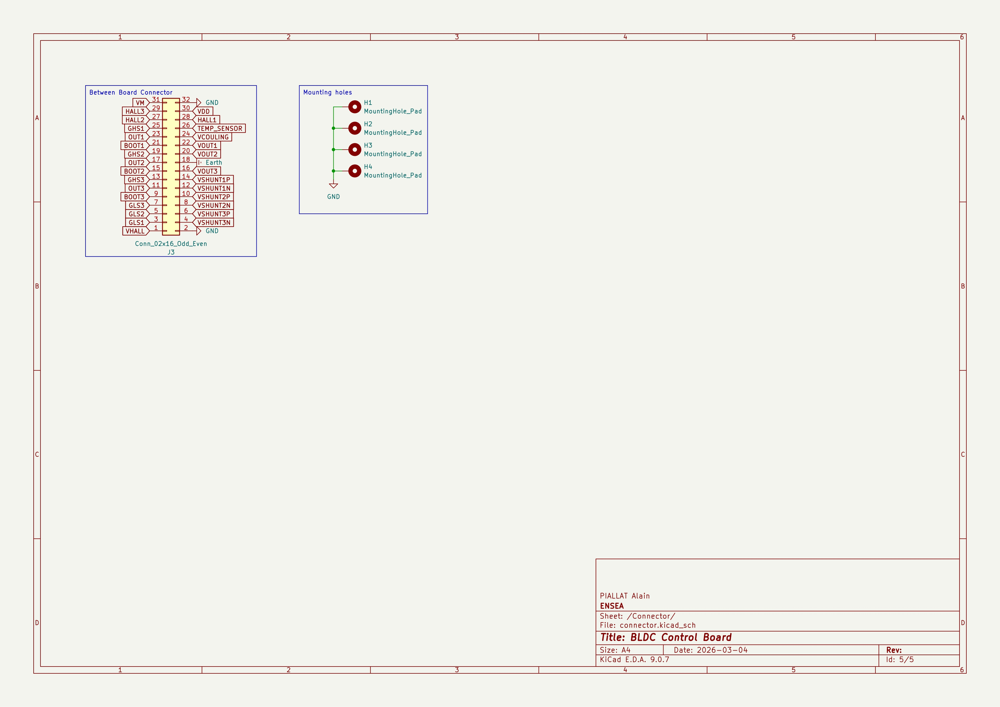
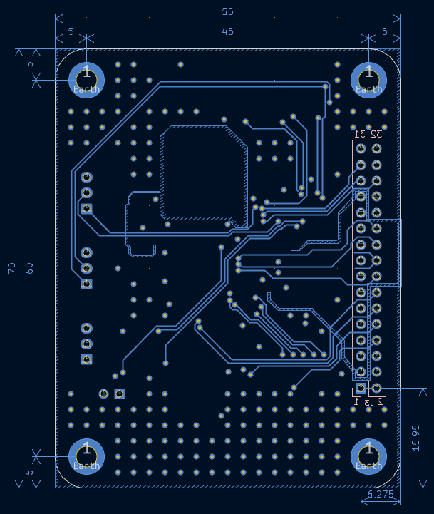

# Carte de contrôle

## Objectif

Le but de cette carte de contrôle est de servir de cerveau que l'on vient plugger sur la carte de puissance adaptée au moteur que l'on souhaite contrôler. Cette connexion se fait via un [shield personalisé](#shield-de-connexion) qui permet de faire passer les signaux nécessaires entre les deux cartes ainsi que de les fixer ensemble. 

Cette carte de contrôle a été conçue autour d'un [STSPIN32G4](https://www.st.com/en/motor-drivers/stspin32g4.html) qui présente l'avantage d'avoir à la fois un microcontrôleur et un driver de mofsets intégré dans la même puce. Cela permet de réduire le nombre de composants nécessaires et ainsi d'avoir une carte plus compacte.

## Shématique de la carte de contrôle :

Le schéma de la carte de contrôle est disponible [ici](./Kicad/BLDC-Control-Board.kicad_sch), il a été séparé en 4 parties pour une meilleure lisibilité :
- [MCU & debug](#mcu--debug) : cette partie regroupe le microcontrôleur ainsi que tous les éléments nécessaires pour le faire fonctionner (oscillateur, capacités, pont diviseur de tension pour la programmation, etc.) ainsi que les diodes de debug.
- [Analog Sensing](#analog-sensing) : cette partie est dédiée à l'acquisition des signaux des capteurs de position (hall effect sensors) pour l'asservissement du moteur.
- [Communication](#communication) : cette partie regroupe les éléments nécessaires pour la communication extérieure (I2C, UART et CAN) ainsi que le ST-Link pour la programmation et le debug.
- [Connector](#connector) : cette partie contient les connecteurs et les point de fixation pour le [shield de connexion](#shield-de-connexion).

### MCU & debug

Cette première partie du schéma regroupe le microcontrôleur (en haut à gauche) ainsi que tous les éléments nécessaires pour le faire fonctionner (oscillateur, capacités, pont diviseur de tension pour la programmation, etc.) ainsi que les diodes de debug (en bas à gauche).

Pour le dimensionnement des différents éléments, nous avons suivi les recommandations de STMicroelectronics présentes dans la [datasheet du STSPIN32G4](https://www.st.com/resource/en/datasheet/stspin32g4.pdf) ainsi que dans les [application notes](https://www.st.com/en/motor-drivers/stspin32g4.html#documentation) associées.

### Analog Sensing

Dans cette partie du schéma, le but est de faire l'acquisition des signaux des capteurs de position (hall effect sensors) pour l'asservissement du moteur. Pour ce faire, nous avons utilisé les amplificateurs opérationnels intégrés dans le STSPIN32G4. Les amplificateurs opérationnels visibles sur le schéma si dessus ne sont donc pas des composants externes, ils sont simplement là afin d'aider à la lisibilité du schéma, par ailleurs afin d'éviter des erreurs lors du test du schéma, l'amplificateur opérationnel manquant du groupe de 4 ainsi que l'alimentation de ces amplificateurs opérationnels ont été dessinés dans le cadre en bas à gauche du schéma.

Par ailleurs, on peut remarquer sur le schéma que la boucle de retour sont barrée, sur le schéma, c'est du au fait que le logiciel que nous avons utilisé pour générer un code pour notre carte impose d'utilise une boucle de retour interne, nous n'avons donc pas peuplé ces composants et nous avons juste remplacer la résistance R_OP4_X par une soudure. Il est possible pour une prochaine version de la carte de retirer ces composants du PCB, cependant il peut être intéressant de les laisser car si on ne passe pas par le logiciel que l'on a utilisé pour générer le code, le fait d'avoir une boucle de retour externe permet d'avoir une plus grande flexibilité dans le choix de la configuration de la boucle de retour (la boucle de retour interne ne permet que de faire des puissance de 2).

### Communication

Cette partie du schéma regroupe les éléments lié à la communication extérieure. L'un des points du cahier des charges de cette carte était de faire une carte universelle qui à therme soit systématiquement utilisée lors que l'on a besoin de contrôler un moteur BDLC dans l'école. Dans ce cadre, il est nécessaire que la carte puisse communiquer avec la majorité des systèmes de contrôle, c'est pourquoi nous avons choisi d'intégrer à la fois une communication I2C, UART et CAN. 

D'autre part nous avons également intégré un connecteur pour le ST-Link avec les signaux nécessaires pour la programmation ainsi que ce nécessaire pour le debug afin de faciliter le développement sur la carte.

### Connector

## PCB

Pour le PCB il a été choisit de le faire en 4 couches afin de pouvoir réduire la taille de la carte tout en respectant les règles de routage. Le PCB a été conçu sur kicad et le fichier de conception est disponible [ici](./Kicad/BLDC-Control-Board.kicad_pcb).

### Répartition des couches
- Couches 1 (Top) contient tout les composants (à l'exception du connecteur avec la carte de puissance qui doit être situé sur la couche du dessous) ainsi que la majorité des pistes de signal.
- Couche 2 (GND) Cette couche est dédiée à la masse de la carte, aucune piste ne passe sur cette couche, les seul éléments présent sur cette couche sont le plan de masse ainsi que les vias.
- Couche 3 (Power) Cette couche est dédiée à l'alimentation de la carte, aucun plan de masse ne passe sur cette couche, Les deux circuits d'alimentation principaux de la carte (VM 24-48V et VBAT 3.3V) utilisent des plans d'alimentation sur cette couche plutôt que des pistes par ailleurs.
- Couche 4 (Bottom) Cette couche contient les pistes de signal qui ne pouvaient pas être routé sur la couche du dessus ainsi que le connecteur pour la carte de puissance qui doit être situé sur cette couche afin de pouvoir faire face à la carte de puissance.

### Largeur des pistes

Pour la largeur des pistes, nous avons séparé les pistes en deux catégories : 
- **les pistes de puissance** : cette catégorie regroupe toutes les pistes qui sont connectées au controleur de MOSFETs du STSPIN32G4, pour ces pistes, nous avons utilisé une largeur de 2 centièmes de pouce (0.508mm), cette largeur a été choisit en s'appuyant sur les largeurs de pistes utilisées par STMicroelectronics dans leur carte d'évaluation du STSPIN32G4 ([EVSPIN32G4](https://www.st.com/en/evaluation-tools/evspin32g4.html)). Cependant la largeur de piste est réduite à 1 centièmes de pouce (0.254mm) au abords de la puce car les pins du STSPIN32G4 sont trop rapprochées pour permettre une largeur de 2 centièmes de pouce.
- **les pistes de signal** : cette catégorie regroupe toutes les autre pistes (mise à part les pistes d'alimentation qui sont des plans d'alimentation), pour ces pistes, nous avons utilisé une largeur de 1 centièmes de pouce (0.254mm).

### isolation

Premièrement une isolation minimal de 0.2mm a été imposé entre toutes les pistes et les pads. Par ailleurs des tranchées d'isolation de 0.4mm traversant tout le PCB ont été ajoutées afin de lutter contre les problèmes de parasites. Ces tranchées d'isolation sont présentes entre les pistes de puissance et les pistes de signal ainsi qu'autour de l'oscillateur qui est une source de parasites importante.

Par ailleurs, conformément au recommandations de STMicroelectronics, au niveau du circuit d'alimentation et de régulation du STSPIN32G4, le PCB est vide sur toutes les couches à l'exception de la première couche ou seul les pistes nécessaires sont présentes, et remplacées par des zones afin d'augmenter la largeur des pistes.

### Shield de connexion

Pour créer une carte de puissance compatible avec cette carte de contrôle, il suffit d'utiliser le même connecteur (les signaux situés au même endroit) et de respecter la disposition suivantes pour les trous de fixation et le connecteur :

