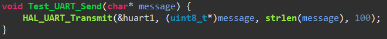
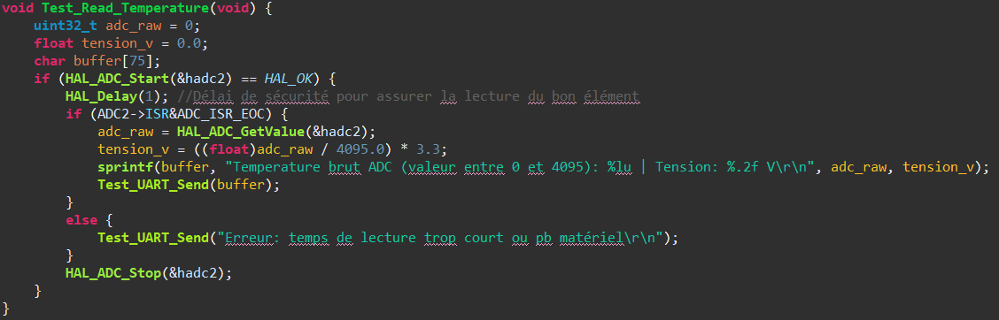
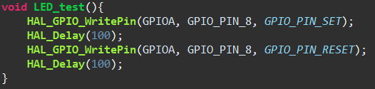
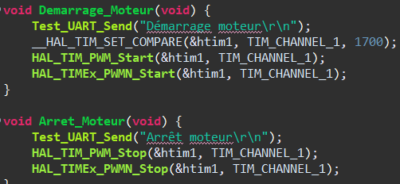

## Documentation des fonctions de test (utils.c et main.c)

### Utilitaires de test (utils.c)

Ces fonctions permettent de vérifier rapidement la communication série, l'acquisition des capteurs et le contrôle moteur.

* **`Test_UART_Send(char* message)`**
 
  * **Rôle :** Envoie une chaîne de caractères sur le port série (UART1).
  * **Utilité :** Permet d'envoyer des messages de débogage ou d'état vers un terminal sur PC.

* **`Test_Read_Temperature()`**
 
  * **Rôle :** Effectue une lecture unique sur le convertisseur analogique-numérique (ADC1) pour échantillonner la tension envoyer par le capteur.
  * **Utilité :** Valider que le capteur de température est correctement branché et configuré.

* **`LED_test()`**
 
  * **Rôle :** Fait clignoter une LED connectée sur la broche `PA8`.
  * **Utilité :** Test de base pour vérifier que la carte est bien alimenté et que le code s'exécute.

* **`Demarrage_Moteur()` / `Arret_Moteur()`**
 
  * **Rôle :** Contrôle les signaux PWM sur `TIM1` (Channel 1 et son complémentaire).
  * **Utilité :** Active ou coupe physiquement la puissance envoyée au moteur.