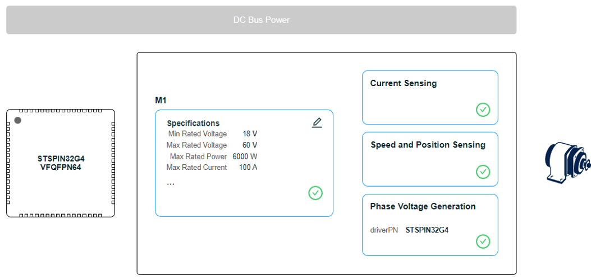
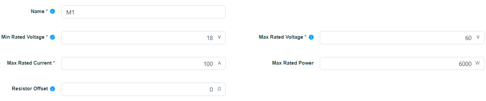
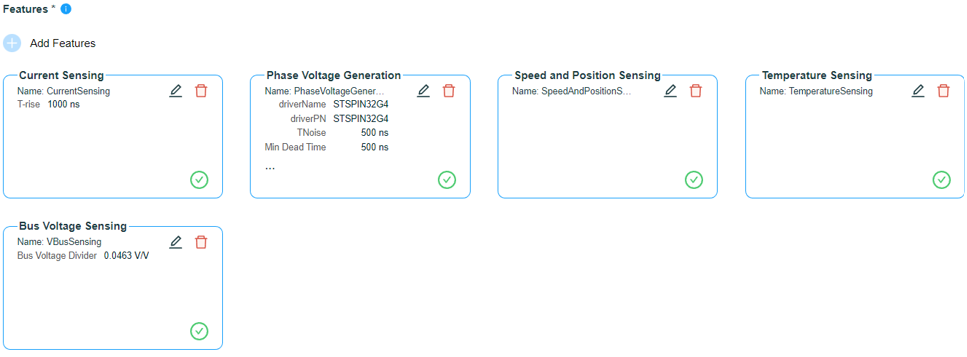
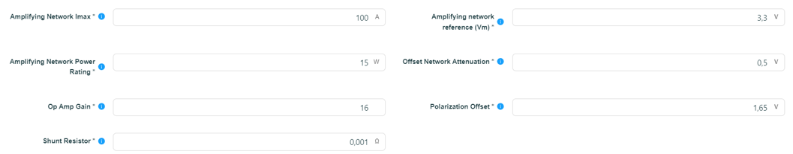
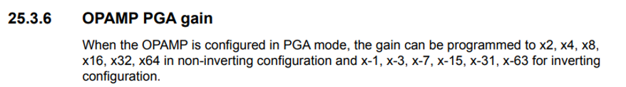
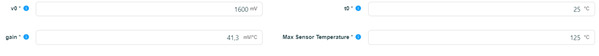
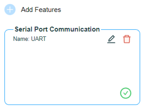

# Inverter : Configuration et Paramétrage de l'Onduleur

## I) Rôle de l'onduleur (Inverter) et environnement de contrôle

**Rôle de l’onduleur :**

La batterie fournit une tension continue, mais notre moteur synchrone a besoin de trois phases alternatives déphasées de 120° pour tourner. L'onduleur réalise cette conversion grâce à un pont de 6 MOSFETs commutant à haute fréquence. Il permet donc de contrôler précisément le couple et la vitesse du moteur, tout en rendant possible le freinage régénératif pour recharger la batterie.

**Choix de l'environnement logiciel :**

Pour piloter le moteur, nous avons choisi la commande vectorielle (FOC = Field Oriented Control). Ce choix s'explique du fait que les algorithmes FOC permettent de maximiser l'efficacité énergétique (couple maximal par ampère), éliminer les à-coups de couple grâce à des courants sinusoïdaux fluides, et dépasser la vitesse nominale du moteur par défluxage (*Field Weakening*) ce qui est parfait pour contrôler le moteur d'un véhicule de compétition.

Cependant, développer cet algorithme de zéro aurait imposé de lourds calculs matriciels et une synchronisation parfaite entre les mesures ADC et les signaux PWM, présentant de gros risques matériels. Nous nous appuyons donc sur ST Motor Control Workbench et STM32CubeMX, qui génèrent une couche bas niveau fiable, nous laissant le temps de nous concentrer sur la stratégie de contrôle de la voiture.

**Paramétrage "Custom Inverter" :**

Dans le logiciel, on a sélectionné l'option "Custom Inverter" (onduleur sur mesure) plutôt que "Control + Power" malgré le fait que nous possédons physiquement une carte de contrôle et une carte de puissance séparées car cela correspond mieux à notre PCB, qui s'articule autour du STSPIN32G4. En effet, comme cette puce intègre à la fois le microcontrôleur et les Gate Drivers, notre systeme se comporte comme un onduleur unique et intégré, même si la logique et la puissance sont sur deux cartes séparées.

 

## II) Paramétrage matériel dans ST Motor Control Workbench

### 4.1) Spécifications de puissance du système (M1 Specifications)

Les limites absolues de la chaîne de traction ont été configurées comme suit pour assurer la sécurité logicielle (Software Over-Current/Over-Voltage) :

* **Max Rated Voltage :** 60V. Cette valeur correspond à la marge dynamique maximale calculée précédemment pour notre batterie.

* **Min Rated Voltage :** 18V. Seuil de coupure bas pour protéger les cellules de la batterie contre les décharges profondes.

* **Max Rated Current :** 100A. Courant de phase maximal autorisé.

* **Max Rated Power :** 6000W (60V × 100A). Puissance maximale théorique de l'étage de puissance.

 

### 4.2) Paramétrage de la détection (Sensing Features)

* **Current Sensing :** C'est le cœur de l'algorithme FOC. Il permet de connaître le courant exact traversant le moteur pour réguler le couple.

  
  

  * **Puissance (15W) :** À 100A, la puissance dissipée par nos shunts de 1mΩ est de 10W. Nous avons configuré 15 W pour indiquer au logiciel notre marge de sécurité matérielle de 50 % lors de la variation de température.

  * **Gain de l'amplificateur (16) :** À 100 A, le shunt génère 0,1 V. L'ADC pouvant lire jusqu'à ± 1,65 V autour de son point zéro, le gain théorique idéal est de 16,5. Le STSPIN32G4 intègre un amplificateur à gain programmable (PGA interne). Cela permet de régler le gain numériquement parmi des valeurs matérielles fixes (2, 4, 8, 16, 32, 64) sans avoir à souder de résistances externes.  En effet, le STSPIN32G4 étant un Sip (System in Package), on trouve dans le Reference Manual du STM32G4 (document RM0440) les valeurs possibles de l’amplification PGA :  
  
   
  Nous sélectionnons le gain de 16 pour maximiser la résolution de la lecture sans jamais saturer l'ADC.

  * **T-rise (1000ns) :** C'est le temps d'attente configuré pour laisser le signal de l'amplificateur se stabiliser (Slew Rate) avant que l'ADC ne prenne sa mesure, garantissant une lecture sans distorsion.
  

* **Phase Voltage Generation :** Permet de traduire les commandes mathématiques de l'algorithme FOC en impulsions électriques (PWM) pour ouvrir et fermer les MOSFETs.

  
  

  * **TNoise (500ns) :** Temps de "masquage" (Blanking time) logiciel. Il empêche l'ADC de lire le courant pendant les 500 nanosecondes qui suivent une commutation de MOSFET pour ignorer le bruit parasite.

  * **Min Dead Time (500ns) :** Temps mort matériel de sécurité. C'est le délai forcé entre l'extinction du MOSFET haut et l'allumage du MOSFET bas d'une même phase pour éviter un court-circuit destructif de la batterie.
  
  * **Max Switching Freq (10 kHz) :** Fréquence de découpage du moteur. 10 kHz est le compromis optimal pour limiter les pertes par commutation (échauffement des MOSFETs) tout en gardant une ondulation de courant acceptable pour le moteur.
  

* **Speed and Position Sensing :** Gère l'acquisition des capteurs (capteurs Hall ou encodeur). Connaître l'angle mécanique absolu du rotor est indispensable pour que l'algorithme FOC puisse orienter parfaitement le champ magnétique du stator à 90° par rapport aux aimants du rotor.
  

* **Temperature Sensing :** Surveille la température de l'étage de puissance (via une thermistance) pour déclencher une réduction de puissance si la carte surchauffe. 
A l’aide de la datasheet, on trouve les paramètres du capteur suivant :

  

* **Bus Voltage Sensing :** Permet à l'algorithme FOC de compenser en temps réel les chutes de tension de la batterie lors des fortes accélérations, et de protéger le système contre les surtensions générées lors du freinage régénératif. Le ratio d'atténuation du pont diviseur est configuré à 0.0463 V/V, correspondant à notre montage matériel (3,3 kΩ / 71,3 kΩ).

 

### 4.3) Interface de communication et supervision

* **Serial Port Communication (UART) :** Le périphérique UART a été activé. Sur un véhicule de compétition, ce bus de communication série est vital puisqu’il permet de remonter la télémétrie en temps réel au pilote et aux stands via le Vehicle Control Unit (VCU) et d'effectuer le réglage fin des correcteurs PI de l'algorithme FOC directement sur la piste.